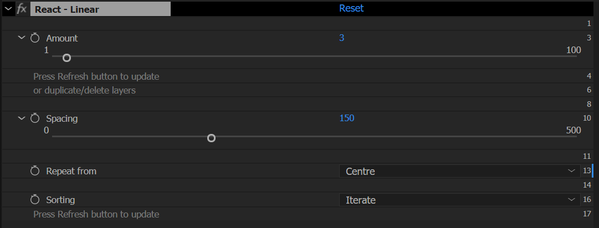
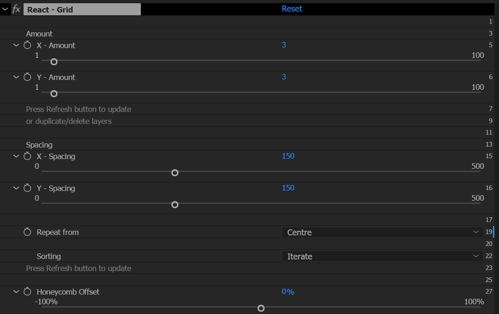
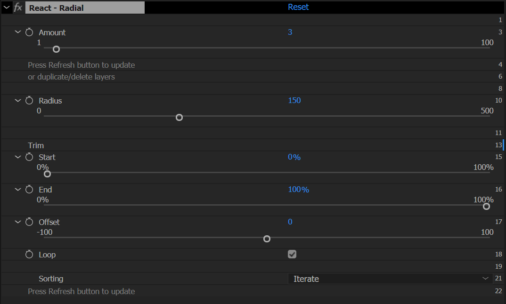
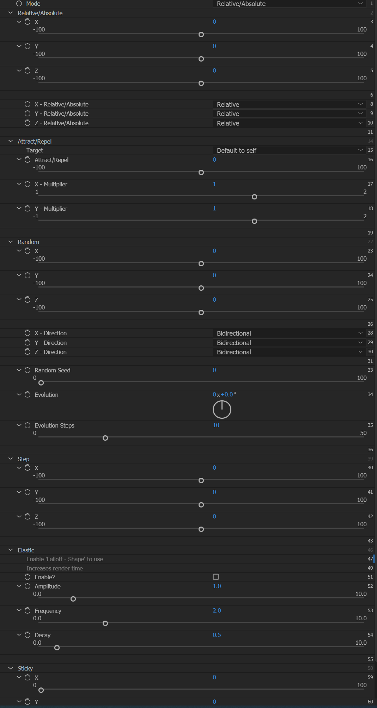
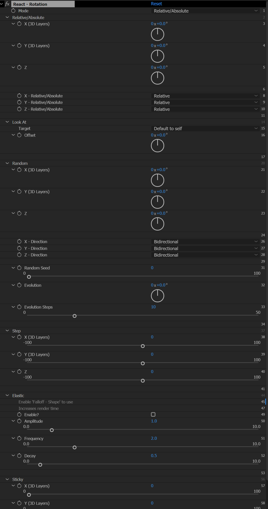
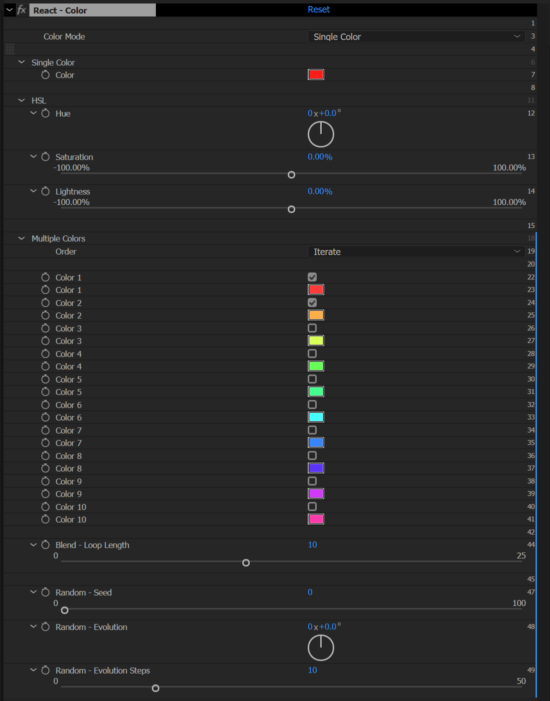

# React - Parametric Cloning for After Effects

## Overview

React is a powerful After Effects extension that enables parametric cloning and dynamic animation effects. Create complex repeater patterns, apply sophisticated effectors, and build procedural animations with ease.

**Key Features:**
- 4 Repeater Types (Linear, Grid, Radial, Path)
- Effectors for any keyframeable property
- 4 Modifiers (Random, Step, Sticky, Noise)
- Advanced Tools (Tracer, Refresh, Delete)

**Video Tutorial:** [Watch on YouTube](https://youtu.be/C8R-feavAv0)

---

## Installation

React is a ZXP extension and should be installed using aescripts' ZXP installer:

**Installation Steps:**
1. Download React from [aescripts.com](https://aescripts.com/react/)
2. Install using [ZXP Installer](https://aescripts.com/learn/post/zxp-installer/)
3. Restart After Effects
4. Open: **Window → Extensions → React**

The React panel will appear in your After Effects workspace.

---

## Toolbar Interface

The React toolbar contains (from left to right):

  

    
123

    
Text Input

  

  

    <svg width="32" height="32" viewBox="0 0 28 28" style="background: #fff; border: 1px solid #ddd; border-radius: 4px; padding: 2px;">
      <circle cx="5" cy="14" r="3" fill="none" stroke="#00c4ff" stroke-width="1.2"/>
      <circle cx="14" cy="14" r="3" fill="none" stroke="#00c4ff" stroke-width="1.2"/>
      <circle cx="23" cy="14" r="3" fill="none" stroke="#00c4ff" stroke-width="1.2"/>
    </svg>
    
Linear

  

  

    <svg width="32" height="32" viewBox="0 0 28 28" style="background: #fff; border: 1px solid #ddd; border-radius: 4px; padding: 2px;">
      <circle cx="5" cy="5" r="3" fill="none" stroke="#00c4ff" stroke-width="1.2"/>
      <circle cx="14" cy="5" r="3" fill="none" stroke="#00c4ff" stroke-width="1.2"/>
      <circle cx="23" cy="5" r="3" fill="none" stroke="#00c4ff" stroke-width="1.2"/>
      <circle cx="5" cy="14" r="3" fill="none" stroke="#00c4ff" stroke-width="1.2"/>
      <circle cx="14" cy="14" r="3" fill="none" stroke="#00c4ff" stroke-width="1.2"/>
      <circle cx="23" cy="14" r="3" fill="none" stroke="#00c4ff" stroke-width="1.2"/>
      <circle cx="5" cy="23" r="3" fill="none" stroke="#00c4ff" stroke-width="1.2"/>
      <circle cx="14" cy="23" r="3" fill="none" stroke="#00c4ff" stroke-width="1.2"/>
      <circle cx="23" cy="23" r="3" fill="none" stroke="#00c4ff" stroke-width="1.2"/>
    </svg>
    
Grid

  

  

    <svg width="32" height="32" viewBox="0 0 28 28" style="background: #fff; border: 1px solid #ddd; border-radius: 4px; padding: 2px;">
      <circle cx="14" cy="4" r="3" fill="none" stroke="#00c4ff" stroke-width="1.2"/>
      <circle cx="5.5" cy="9" r="3" fill="none" stroke="#00c4ff" stroke-width="1.2"/>
      <circle cx="4" cy="18" r="3" fill="none" stroke="#00c4ff" stroke-width="1.2"/>
      <circle cx="10" cy="24" r="3" fill="none" stroke="#00c4ff" stroke-width="1.2"/>
      <circle cx="18" cy="24" r="3" fill="none" stroke="#00c4ff" stroke-width="1.2"/>
      <circle cx="24" cy="18" r="3" fill="none" stroke="#00c4ff" stroke-width="1.2"/>
      <circle cx="22.5" cy="9" r="3" fill="none" stroke="#00c4ff" stroke-width="1.2"/>
    </svg>
    
Radial

  

  

    <svg width="32" height="32" viewBox="0 0 28 28" style="background: #fff; border: 1px solid #ddd; border-radius: 4px; padding: 2px;">
      <path d="M 6 20 C 6 10, 13 11, 14 14 C 15 17, 22 18, 22 8" fill="none" stroke="#00c4ff" stroke-width="1.2"/>
      <circle cx="6" cy="23" r="3" fill="none" stroke="#00c4ff" stroke-width="1.2"/>
      <circle cx="22" cy="5" r="3" fill="none" stroke="#00c4ff" stroke-width="1.2"/>
    </svg>
    
Path

  

  

    <svg width="32" height="32" viewBox="0 0 28 28" style="background: #fff; border: 1px solid #ddd; border-radius: 4px; padding: 2px;">
      <circle cx="14" cy="14" r="10.5" fill="none" stroke="#8471FF" stroke-width="1.2"/>
      <line x1="14" y1="8" x2="14" y2="20" stroke="#8471FF" stroke-width="1.2" stroke-linecap="round"/>
      <line x1="8" y1="14" x2="20" y2="14" stroke="#8471FF" stroke-width="1.2" stroke-linecap="round"/>
    </svg>
    
Effector

  

  

    <svg width="32" height="32" viewBox="0 0 28 28" style="background: #fff; border: 1px solid #ddd; border-radius: 4px; padding: 2px;">
      <rect x="3.5" y="3.5" width="21" height="21" fill="none" stroke="#8471FF" stroke-width="1.2"/>
      <line x1="3.5" y1="10.5" x2="24.5" y2="10.5" stroke="#8471FF" stroke-width="1.2"/>
      <line x1="3.5" y1="17.5" x2="24.5" y2="17.5" stroke="#8471FF" stroke-width="1.2"/>
      <line x1="10.5" y1="3.5" x2="10.5" y2="24.5" stroke="#8471FF" stroke-width="1.2"/>
      <line x1="17.5" y1="3.5" x2="17.5" y2="24.5" stroke="#8471FF" stroke-width="1.2"/>
    </svg>
    
Tracer

  

  

    <svg width="32" height="32" viewBox="0 0 28 28" style="background: #fff; border: 1px solid #ddd; border-radius: 4px; padding: 2px;">
      <path d="M25.6 11C24.8 7.1 20.6 2 14 2S2 7.4 2 14 7.4 26 14 26s9.8-4.8 10.6-6.4M26.3 3 26.3 11 18.3 11" fill="none" stroke="#8471FF" stroke-width="1.2" stroke-linecap="round" stroke-linejoin="round"/>
    </svg>
    
Refresh

  

  

    <svg width="32" height="32" viewBox="0 0 28 28" style="background: #fff; border: 1px solid #ddd; border-radius: 4px; padding: 2px;">
      <circle cx="14" cy="14" r="11.67" fill="none" stroke="#EC5E5E" stroke-width="1.2"/>
      <line x1="9.33" y1="9.33" x2="18.67" y2="18.67" stroke="#EC5E5E" stroke-width="1.2" stroke-linecap="round"/>
      <line x1="18.67" y1="9.33" x2="9.33" y2="18.67" stroke="#EC5E5E" stroke-width="1.2" stroke-linecap="round"/>
    </svg>
    
Delete

  

**Toolbar Controls:**

1. **Text Input Box** - Enter amount of layers
2. **Linear Repeater** - Repeat in a line
3. **Grid Repeater** - Repeat in rows and columns
4. **Radial Repeater** - Repeat in a circle
5. **Path Repeater** - Repeat along a path
6. **Add Effector** - Apply effects to properties
7. **Tracer** - Connect layers with lines
8. **Refresh** - Update repeaters and effectors
9. **Delete** - Remove React elements

---

## Repeaters

### Setting Up a Repeater

Click any of the repeater buttons to set up a repeater.

A Repeater null is created each time a repeater button is clicked. As well as changing position, scale and rotation for the repeater, there is also an effect on this null which affects amount, spacing and sorting modes.

**Workflow:**
- **With layers selected:** Selected layers will be repeated
- **No layers selected:** Null layers will be created and repeated
- **Multiple layers:** Layers will iterate through the repeater by default

### Setting the Amount of Repeated Layers

**Option 1: Text Input (Before Creating)**
- Enter a number in the text field before clicking repeater button
- **Grid:** Use one number (e.g., "10" → 10×10) or two numbers (e.g., "10x5" → 10 columns, 5 rows)
- Separators: space, comma, *, -, or _
- **Linear/Radial/Path:** First number only

**Option 2: After Creation**
- Create repeater first
- Select Repeater null and change amount
- Press **Refresh** button to add/remove layers

**Option 3: Use Defaults**
- Leave text input blank
- Default values from Preferences will be used

### Repeater Settings

Select the Repeater null to see controls in the Effects panel:

**Amount**
- Change number of layers
- Press Refresh to add/remove layers

**Spacing/Radius**
- Distance between layers
- Radius for radial repeaters
- Scale the Repeater null to adjust spacing

**Repeat From**
- **Centre:** Repeater null positioned at center of pattern
- **First Layer:** Repeater null positioned at first layer

**Sorting**
- **Iterate:** Sequential order (1, 2, 3, 1, 2, 3, 1, 2, 3...)
- **Cluster:** Group same layers (1, 1, 1, 2, 2, 2, 3, 3, 3...)
- **Random:** Random arrangement (press Refresh for new random)
- **Rows/Columns:** Grid only - arrange by rows or columns

*Remember to press Refresh after changing sorting mode.*

---

### Linear Repeater

Duplicate layers in a straight line.

*Linear Repeater controls in Effects panel*

**How to Use:**
1. Select layer(s) in composition
2. Enter amount in text input (e.g., "10")
3. Click **Linear Repeater** button

**Controls:**
- **Amount** - Number of clones (default: 6)
- **Spacing** - Distance between clones (default: 100px)
- **Rotation** - Rotation angle for entire array
- **Scale** - Scale multiplier for entire array
- **Repeat from** - Start from first layer or center pattern
- **Offset** - Manual position adjustment

**Use Cases:**
- Title sequences with staggered text
- Fence posts or pillars
- Animation steps

---

### Grid Repeater

Arrange layers in rows and columns.

*Grid Repeater controls in Effects panel*

**How to Use:**
1. Select layer(s) in composition
2. Enter dimensions in text input:
   - Single number: "10" → 10×10 grid
   - Two numbers: "10x5" → 10 columns, 5 rows
3. Click **Grid Repeater** button

**Controls:**
- **Amount** - Grid dimensions (X × Y)
- **Spacing** - Distance between clones (X and Y)
- **Rotation** - Rotation angle for entire grid
- **Scale** - Scale multiplier for entire grid
- **Repeat from** - Position grid from corner or center
- **Offset** - Manual position adjustment (X and Y)
- **Honeycomb Offset** - Offset alternate rows for honeycomb pattern

**Use Cases:**
- Tiled backgrounds
- Crowd duplication
- Photo grids
- Honeycomb patterns

---

### Radial Repeater

Distribute layers in a circle.

*Radial Repeater controls in Effects panel*

**How to Use:**
1. Select layer(s) in composition
2. Enter amount in text input (e.g., "23")
3. Click **Radial Repeater** button

**Controls:**
- **Amount** - Number of clones around circle (default: 23)
- **Radius** - Distance from center point
- **Rotation** - Starting rotation angle
- **Scale** - Scale multiplier for entire array
- **Start Angle** - Where circle begins (default: 0°)
- **End Angle** - Where circle ends (default: 360°)
- **Offset** - Rotational offset adjustment
- **Loop** - Enable seamless looping with Offset

**Trim Settings:**
- **Start/End:** Position first/last layers
- **Loop Enabled:** Layers loop seamlessly across circle
- **Loop Disabled:** Layers constrained to start/end points

**Use Cases:**
- Clock numbers
- Circular menus
- Mandala patterns
- Radial progress indicators

---

### Path Repeater

Distribute layers along a custom path.

*Path Repeater controls in Effects panel*

**How to Use:**

**Option 1: Create New Path**
1. Select layer(s) in composition
2. Enter amount in text input (e.g., "10")
3. Click **Path Repeater** button
4. Select **Create new path** radio button
5. Choose number of points (3-10)
6. Enable **Use bezier curves** for smooth curves
7. Click **Continue**

**Option 2: Select Existing Path**
1. Select layer(s) in composition
2. Select a shape path property in timeline
3. Click **Path Repeater** button
4. Select **Select existing path** radio button
5. Click **Continue**

**Controls:**
- **Amount** - Number of clones along path (default: 10)
- **Offset** - Shift position along path (0-100%)
- **Rotation** - Rotation angle for entire array
- **Scale** - Scale multiplier for entire array
- **Start/End** - Trim settings (like Radial)
- **Loop** - Enable seamless looping

**Use Cases:**
- Text on path
- Following motion graphics
- Custom distribution patterns
- Organic animations

---

## Effectors

### Effector Overview

Effectors apply dynamic transformations to properties based on layer index or distance from an effector layer.

**New in React 2:** Apply effectors to almost any keyframeable property in After Effects!

### Adding an Effector

1. Select any layer property (or properties) that accepts keyframes
   - Position, Scale, Rotation, Opacity, Color, Start, End, etc.
2. Click **Add Effector** button

**Smart Selection:**
- If property is in a repeater → Effector applies to ALL layers in repeater
- Hold **ALT** when clicking → Apply only to selected layer
- Select multiple properties → All get effector controls

**Result:**
- **Effector null** - Contains all effector settings
- **Guide layer** - Visualizes falloff (only visible when falloff enabled)

---

### Effector Settings

#### Position Effector

Control the X and Y position of repeated layers.

*Position Effector controls in Effects panel*

**Mode: Relative/Absolute**
- Set X, Y, Z to be relative to current position or absolute position

**Mode: Attract/Repel**
- **Attract/Repel Amount** - Negative = attract, Positive = repel
- **Target** - Layer to attract to (default: effector layer)
- **X/Y Multiplier** - Modify per dimension

**Common Uses:**
- Scattered text layouts
- Organic motion
- Physics simulations

---

#### Rotation Effector

Control the rotation (Z, X, Y) of repeated layers.

*Rotation Effector controls in Effects panel*

**Mode: Relative/Absolute**
- Set X, Y, Z to be relative to current rotation or absolute rotation
- X and Y only affect 3D layers

**Mode: Look At**
- **Target** - Layer to look at (default: effector layer)
- **Offset** - Angle offset when aiming at target

**Common Uses:**
- Text rotation variations
- Camera facing elements
- Aim constraints

---

#### Scale Effector

Control the uniform or independent X/Y scale of repeated layers.

*Scale Effector controls in Effects panel*

**Controls:**
- **Uniform Scale** - Checkbox to link X and Y scale (enabled by default)
- **X / Y / Z Scale** - Independent scale controls
- **Relative/Absolute** - Per dimension setting

**Common Uses:**
- Size variations
- Pulsing animations
- Depth perception
- Breathing effects

---

#### Opacity Effector

Control the transparency of repeated layers.

**Available Modes:**
- **Random** - Randomize opacity values
- **Step** - Incremental opacity change per clone
- **Noise** - Animated opacity flicker

**Common Uses:**
- Fade patterns
- Twinkling effects
- Depth of field simulation
- Glitch effects

---

#### Color Effector

Change colors across repeated layers.

*Color Effector controls in Effects panel*

**Mode: Single Color**
- Set one color for effector

**Mode: HSL**
- Adjust Hue, Saturation, Lightness

**Mode: Multiple Colors**
- Enable up to 10 different colors
- **Order:** Iterate, Blend, or Random
- **Blend Loop Length:** End point of blend cycle
- **Random:** Seed, Evolution, Evolution Steps

**Common Uses:**
- Color gradients
- Rainbow effects
- Brand color schemes

---

## Modifiers

Modifiers work with all effector types (except Color has different options).

### Random Modifier

Add randomness to any effector property.

**Setup:**
1. Select Effector null
2. Expand property section in Effect Controls
3. Enable "Random" modifier
4. Adjust settings:
   - **Amount:** Maximum random variation
   - **Seed:** Different random patterns
   - **Evolution:** 0-360 degrees for animation
   - **Evolution Steps:** Fewer changes = smoother loop

**Perfect Loops:**
- Set Evolution to 360°
- Lower Evolution Steps for fewer changes

---

### Step Modifier

Create progressive changes based on layer order.

**Setup:**
1. Select Effector null
2. Expand property section
3. Enable "Step" modifier
4. Adjust Step value:
   - **Positive:** Increases effect with each layer
   - **Negative:** Decreases effect with each layer

**Note:** First layer (index 0) multiplies by 0, last layer by maximum index

---

### Sticky Modifier

Snap property values to specific intervals.

**Setup:**
1. Select Effector null
2. Expand property section
3. Enable "Sticky" modifier
4. Set increment value:
   - **Rotation:** 90 for right angles
   - **Position:** Whole numbers for grid alignment
   - **Scale:** Common percentages (like 100)

**Use Cases:**
- Stair-step animations
- Quantized motion
- Retro effects
- Grid snapping

---

### Elastic Modifier

Add spring-like bounce to effector animations.

**Setup:**
1. Create effector with animated property
2. Enable "Elastic" modifier
3. Adjust parameters:
   - **Amplitude:** Bounce strength
   - **Frequency:** Oscillation speed
   - **Decay:** How fast bounce stops

**Use Cases:**
- Cartoon physics
- Spring animations
- Natural motion
- Overshoot effects

---

### Falloff

Control how effector influence diminishes over distance.

**Setup:**
1. Select Effector null
2. In React - Effector effect:
   - **Shape:** Off, Circle, Box, or Linear
   - **Size:** Falloff radius
   - **Hold:** Falloff sharpness (0-100%)

**Hold Setting:**
- **0%:** Gradual change, few properties reach maximum
- **50%:** Balanced falloff (default)
- **100%:** Immediate change, all properties reach maximum within falloff

**Animation Modes:**
- **In:** Effect increases into falloff
- **In & Out:** Effect peaks in center (default)
- **Inverse:** Reverses effector

**Easing:**
- Linear, Ease In, Ease Out, Ease In & Out, Custom
- Custom: Adjust Ease In/Out X and Y values

**Use Cases:**
- Localized effects
- Ripple animations
- Force field simulation
- Organic motion

---

## Tools

### Tracer

Create animated lines connecting repeated layers.

**How to Use:**
1. Create a repeater (any type)
2. Select Repeater null
3. Click **Tracer** button

**Result:**
- Shape layer "React Tracer 1" appears
- Connected lines between layer positions

**Controls:**
- **Close Path:** Checkbox for closed shapes
- **Trim Paths:** Animate line reveal
- **Stroke:** Color and width in layer properties

**Grid Controls (Grid Repeater only):**
- **Grid:** Standard grid pattern
- **Snake:** Continuous line through grid
- **Zigzag:** Alternating direction pattern

**Use Cases:**
- Constellation patterns
- Network diagrams
- Motion trails
- Connect-the-dots effects

---

### Working with Text Layers

Apply repeaters to text with automatic character splitting.

**Setup:**
1. Create or select text layer
2. Click any repeater button
3. In React Repeater effect controls, find "Text Source"
4. Choose splitting method:
   - **Letters:** Each character becomes separate
   - **Letters excluding spaces:** Ignores whitespace
   - **Words:** Splits at spaces
   - **Lines:** Splits at line breaks

**Grid updates automatically while typing!**

**Adding Effects:**
1. Must add repeater first
2. Select text property to affect
3. Click Add Effector
4. Adjust as normal

---

### Refresh

Update repeater settings and refresh layer structure.

**For Repeaters:**
1. Select React Repeater null
2. Adjust repeater controls (amount, sorting, etc.)
3. Click **Refresh** button
4. Repeater updates with new settings

**For Effectors:**
1. Select existing Effector null
2. Hold **Ctrl/Cmd** and select new properties
3. Click **Refresh** button
4. New properties added to effector

**Alt+Click Refresh:** Update ALL repeaters in composition

---

### Delete

Remove React elements and optionally bake animations to keyframes.

**How to Use:**

**Delete Selected:**
1. Select repeater layer, effector layer, or affected layers
2. Click **Delete** button
3. Choose baking mode:
   - **No Baking:** Remove expressions, revert to original
   - **Current Frame:** Bake current values as static
   - **All Frames:** Bake full animation to keyframes

**Delete All:**
1. Click **Delete** button (no selection)
2. Choose baking mode (same options)

**What Gets Deleted:**
- Repeater null layers
- Effector layers
- React expressions from layers
- React pseudo effects from layers

**Smart Deletion:**
- Deleting one effector preserves others on same property
- Deleting repeater preserves effectors
- Position expressions preserved when repeater remains

**Use Cases:**
- Clean up finished animations
- Bake procedural motion to keyframes
- Remove React dependencies
- Reduce project complexity

---

## Support

**Need Help?**
- [User Documentation](https://mograph-tools.github.io/react-docs/)
- [Video Tutorial](https://youtu.be/C8R-feavAv0)
- [Report Bug](https://github.com/mograph-tools/react/issues)
- [Feature Request](https://github.com/mograph-tools/react/issues)

**Version:** 2.2.1
**Developer:** mograph.tools
**Built with:** Claude Code

---

*Copyright © 2025 mograph.tools. All rights reserved.*
