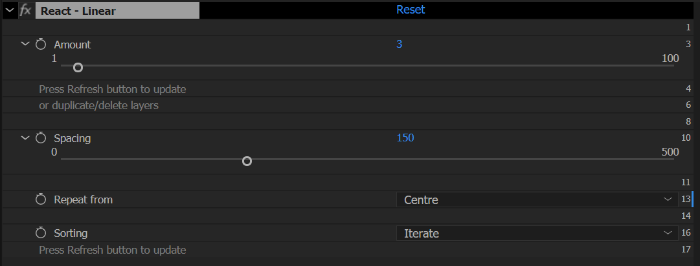
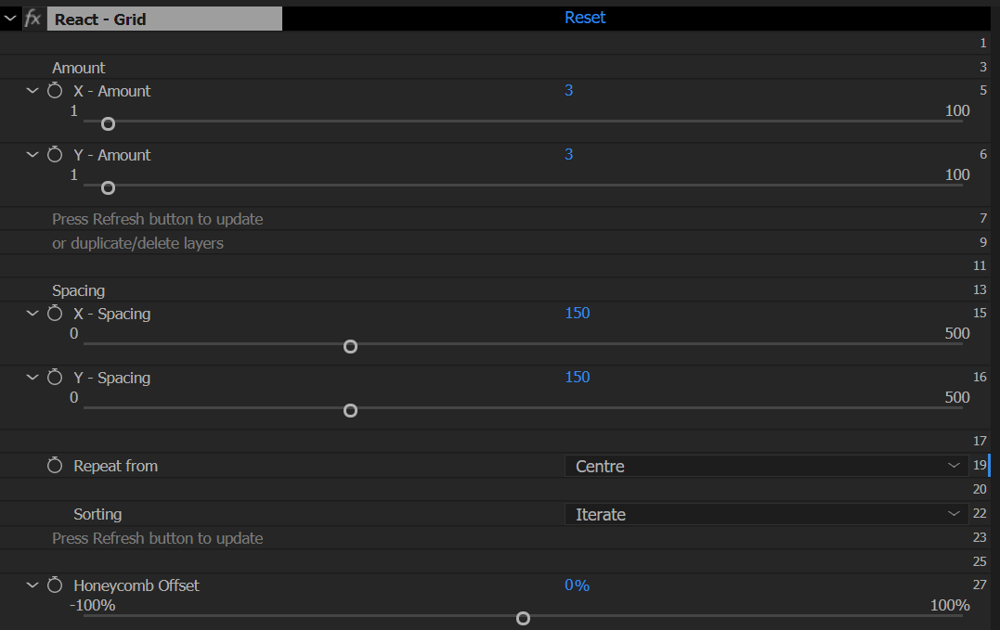
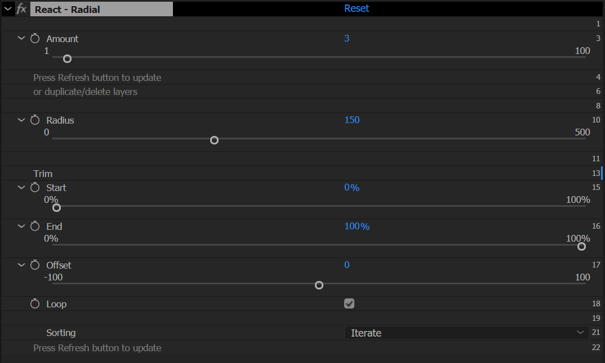
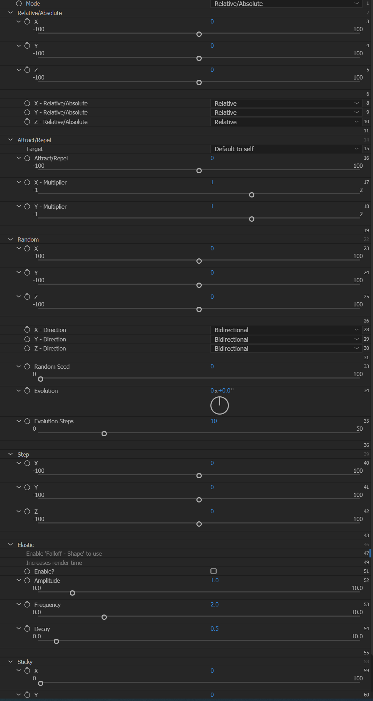
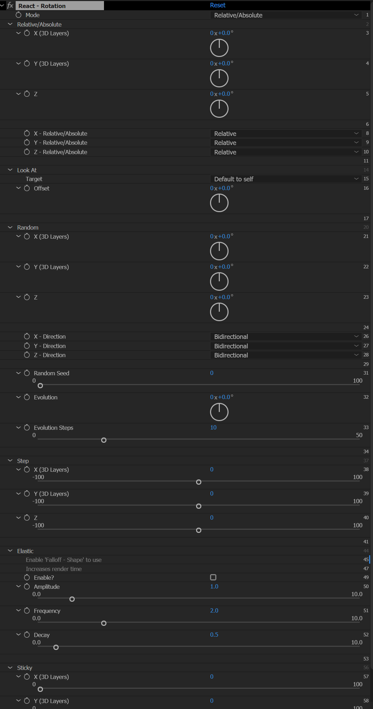
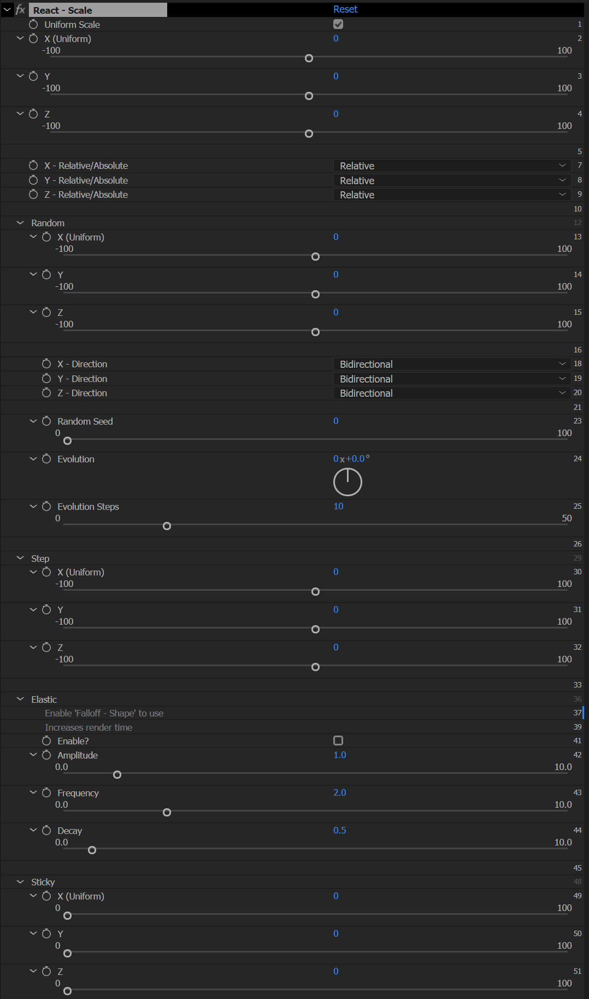
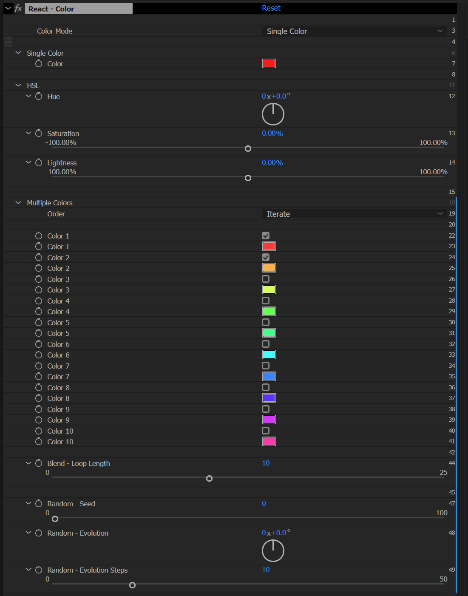

## Overview

React is a parametric cloning tool for After Effects. Select one or more layers, click a repeater button, and React duplicates those layers into a repeater. Effectors change property values across all layers in the repeater at once. Tracers draw lines between layers. Everything is expression-based and updates live.

React works with any layer type: shape layers, text layers, footage, pre-comps, and native 3D layers (imported .obj/.gltf models and AE 2026+ parametric mesh shapes).

## Installation

1. Download React from your aescripts account.
2. Install the ZXP file using the aescripts + aeplugins app.
3. Restart After Effects.
4. Open the panel: Window > Extensions > React.
5. Run the initialization script if prompted. This installs the pseudo effects React needs.

If expressions show an error after opening a project, run the initialization script again from the panel menu.

## Toolbar Interface

The React panel has a text input and eight buttons.

Enter a number in the text input before clicking a repeater button to set the layer count. Leave it blank to use the default from Preferences.

Shift-click any button to open the relevant help section.

  

    

      <svg width="28" height="28" viewBox="0 0 28 28">
        <circle cx="5" cy="14" r="3" fill="none" stroke="#00c4ff" stroke-width="1.2"/>
        <circle cx="14" cy="14" r="3" fill="none" stroke="#00c4ff" stroke-width="1.2"/>
        <circle cx="23" cy="14" r="3" fill="none" stroke="#00c4ff" stroke-width="1.2"/>
      </svg>
    

    

      <h3 style="margin: 0 0 8px 0; font-size: 18px; color: #303030;">Linear Repeater</h3>
      
Select one or more layers, then press to repeat in a line. Enter the amount in the text input.

    

  

  

    

      <svg width="28" height="28" viewBox="0 0 28 28">
        <circle cx="5" cy="5" r="3" fill="none" stroke="#00c4ff" stroke-width="1.2"/>
        <circle cx="14" cy="5" r="3" fill="none" stroke="#00c4ff" stroke-width="1.2"/>
        <circle cx="23" cy="5" r="3" fill="none" stroke="#00c4ff" stroke-width="1.2"/>
        <circle cx="5" cy="14" r="3" fill="none" stroke="#00c4ff" stroke-width="1.2"/>
        <circle cx="14" cy="14" r="3" fill="none" stroke="#00c4ff" stroke-width="1.2"/>
        <circle cx="23" cy="14" r="3" fill="none" stroke="#00c4ff" stroke-width="1.2"/>
        <circle cx="5" cy="23" r="3" fill="none" stroke="#00c4ff" stroke-width="1.2"/>
        <circle cx="14" cy="23" r="3" fill="none" stroke="#00c4ff" stroke-width="1.2"/>
        <circle cx="23" cy="23" r="3" fill="none" stroke="#00c4ff" stroke-width="1.2"/>
      </svg>
    

    

      <h3 style="margin: 0 0 8px 0; font-size: 18px; color: #303030;">Grid Repeater</h3>
      
Select one or more layers, then press to repeat in a grid. Separate X and Y values with a space, comma, x, *, or -.

      
3DAdd a third value for a 3D grid (e.g. 5x4x3).

    

  

  

    

      <svg width="28" height="28" viewBox="0 0 28 28">
        <circle cx="14" cy="4" r="3" fill="none" stroke="#00c4ff" stroke-width="1.2"/>
        <circle cx="22.5" cy="9.5" r="3" fill="none" stroke="#00c4ff" stroke-width="1.2"/>
        <circle cx="22.5" cy="18.5" r="3" fill="none" stroke="#00c4ff" stroke-width="1.2"/>
        <circle cx="14" cy="24" r="3" fill="none" stroke="#00c4ff" stroke-width="1.2"/>
        <circle cx="5.5" cy="18.5" r="3" fill="none" stroke="#00c4ff" stroke-width="1.2"/>
        <circle cx="5.5" cy="9.5" r="3" fill="none" stroke="#00c4ff" stroke-width="1.2"/>
      </svg>
    

    

      <h3 style="margin: 0 0 8px 0; font-size: 18px; color: #303030;">Radial Repeater</h3>
      
Select one or more layers, then press to repeat in a circle. Enter the amount in the text input.

      
3DFor a 3D radial repeater, enter two numbers: ring count and depth layers (e.g. 12 4).

    

  

  

    

      <svg width="28" height="28" viewBox="0 0 28 28">
        <path d="M 6 20 C 6 10, 13 11, 14 14 C 15 17, 22 18, 22 8" fill="none" stroke="#00c4ff" stroke-width="1.2"/>
        <circle cx="6" cy="23" r="3" fill="none" stroke="#00c4ff" stroke-width="1.2"/>
        <circle cx="22" cy="5" r="3" fill="none" stroke="#00c4ff" stroke-width="1.2"/>
      </svg>
    

    

      <h3 style="margin: 0 0 8px 0; font-size: 18px; color: #303030;">Path Repeater</h3>
      
Select one or more layers, then press to repeat along a path. A dialog appears where you can select an existing path or create a new one. Enter the amount in the text input.

    

  

  

    

      <svg width="28" height="28" viewBox="0 0 28 28">
        <circle cx="14" cy="14" r="10.5" fill="none" stroke="#8471FF" stroke-width="1.2"/>
        <line x1="14" y1="8" x2="14" y2="20" stroke="#8471FF" stroke-width="1.2" stroke-linecap="round"/>
        <line x1="8" y1="14" x2="20" y2="14" stroke="#8471FF" stroke-width="1.2" stroke-linecap="round"/>
      </svg>
    

    

      <h3 style="margin: 0 0 8px 0; font-size: 18px; color: #303030;">Add Effector</h3>
      
Select one or more layer properties, then press to add an effector. If the property belongs to a layer inside a repeater, the effector applies to all layers in that repeater. Hold Alt to apply to the selected layer only.

    

  

  

    

      <svg width="28" height="28" viewBox="0 0 28 28">
        <rect x="3.5" y="3.5" width="21" height="21" fill="none" stroke="#8471FF" stroke-width="1.2"/>
        <line x1="3.5" y1="10.5" x2="24.5" y2="10.5" stroke="#8471FF" stroke-width="1.2"/>
        <line x1="3.5" y1="17.5" x2="24.5" y2="17.5" stroke="#8471FF" stroke-width="1.2"/>
        <line x1="10.5" y1="3.5" x2="10.5" y2="24.5" stroke="#8471FF" stroke-width="1.2"/>
        <line x1="17.5" y1="3.5" x2="17.5" y2="24.5" stroke="#8471FF" stroke-width="1.2"/>
      </svg>
    

    

      <h3 style="margin: 0 0 8px 0; font-size: 18px; color: #303030;">Add Tracer</h3>
      
Select a React Repeater null to trace all its layers. Or select two or more layers in order to trace those specific layers. Do not mix Repeater nulls and individual layers in the same selection.

    

  

  

    

      <svg width="28" height="28" viewBox="0 0 28 28">
        <path d="M25.6 11C24.8 7.1 20.6 2 14 2S2 7.4 2 14 7.4 26 14 26s9.8-4.8 10.6-6.4M26.3 3 26.3 11 18.3 11" fill="none" stroke="#8471FF" stroke-width="1.2" stroke-linecap="round" stroke-linejoin="round"/>
      </svg>
    

    

      <h3 style="margin: 0 0 8px 0; font-size: 18px; color: #303030;">Refresh</h3>
      
Select a Repeater null to update its layer count, sorting, and tree characters. Or select an Effector null and one or more properties to add those properties to the effector. Hold Alt to apply to the selected layer only.

    

  

  

    

      <svg width="28" height="28" viewBox="0 0 28 28">
        <circle cx="14" cy="14" r="11.67" fill="none" stroke="#EC5E5E" stroke-width="1.2"/>
        <line x1="9.33" y1="9.33" x2="18.67" y2="18.67" stroke="#EC5E5E" stroke-width="1.2" stroke-linecap="round"/>
        <line x1="18.67" y1="9.33" x2="9.33" y2="18.67" stroke="#EC5E5E" stroke-width="1.2" stroke-linecap="round"/>
      </svg>
    

    

      <h3 style="margin: 0 0 8px 0; font-size: 18px; color: #303030;">Delete</h3>
      
Select a React Repeater or Effector null and click Delete. Choose whether to bake the current frame, bake all frames as keyframes, or remove without baking.

    

  

---

## Repeaters

### Setup

Click any repeater button to create a repeater.

With layers selected, React repeats those layers. With nothing selected, React creates null cloner layers.

Selecting a single text layer activates Text Layer Repeater mode. See [Text Layers](#working-with-text-layers).

When native 3D layers are selected (imported .obj or .gltf models, or AE 2026+ parametric mesh shapes), React pre-composites each one before duplication so layer names remain unique and tracer expressions resolve correctly.

React creates a Repeater null. Select it to see the repeater controls in the Effects panel.

### Amounts

Enter a number in the text input before clicking. Leave it blank to use the preference default.

To update the layer count after creation: change the Amount in the Effects panel, then press Refresh.

**Grid:** enter one number to use the same value for X and Y. Enter two numbers for X and Y. Enter three numbers for X, Y, and Z (creates a 3D grid). Separate numbers with a space, comma, x, *, or -.

**Radial:** enter two numbers for ring count and depth layers (creates a 3D radial repeater).

Invalid characters in the input are ignored. Only numeric values are extracted.

### Sorting

Change the Sorting dropdown in the repeater effect, then press Refresh.

- **Iterate**: layers cycle in sequence. With three source layers: 1, 2, 3, 1, 2, 3. This is the default.
- **Cluster**: layers group by type. With three source layers: 1, 1, 1, 2, 2, 2, 3, 3, 3.
- **Random**: random arrangement. Press Refresh again for a different arrangement.
- **Rows** (Grid only): layers arranged row by row.
- **Columns** (Grid only): layers arranged column by column.

  <svg width="18" height="18" viewBox="0 0 24 24" fill="none" stroke="#00c4ff" stroke-width="2" stroke-linecap="round" stroke-linejoin="round" style="flex-shrink:0;margin-top:2px;"><path d="M9 21h6M12 3C8.686 3 6 5.686 6 9c0 2.12 1.046 3.99 2.644 5.144C9.48 14.815 9.978 15.866 10 17h4c.022-1.134.52-2.185 1.356-2.856C16.954 12.99 18 11.12 18 9c0-3.314-2.686-6-6-6z"/></svg>
  
<strong style="color:#00c4ff;font-size:13px;display:block;margin-bottom:4px;">Tip</strong>To lock repeated layers to the Repeater null's rotation, parent them to the Repeater null. The layers follow the null's rotation while keeping their repeater positions.

### Repeat from

Controls where the Repeater null sits relative to the group.

- **Centre**: the Repeater null sits at the centre of the group.
- **First Layer**: the Repeater null sits at the position of the first layer.

### Linear Repeater

Arranges layers in a line.

- **Amount**: number of layers.
- **Spacing**: distance between layers. Scale the null to change this proportionally.
- **Rotation**: rotates the entire group.
- **Repeat from**: Centre or First Layer.
- **Offset**: shifts the entire group along the line.
- **Sorting**: see Sorting above.

### Grid Repeater

Arranges layers in a grid.

- **X Amount / Y Amount**: columns and rows.
- **X Spacing / Y Spacing**: distance between layers per axis. Scale the null to change these proportionally.
- **Rotation**: rotates the entire group on the Z axis.
- **Repeat from**: Centre or First Layer.
- **Offset X / Offset Y**: shifts the group per axis.
- **Honeycomb Offset**: offsets alternating rows on X to create a honeycomb arrangement.
- **Sorting**: see Sorting above.

3D<strong>3D Grid:</strong> enter a third number in the amount input (e.g. <code>5x4x3</code>) to create a three-dimensional grid. The Repeater null becomes a 3D layer automatically. This adds:

- **Z - Amount**: number of depth layers.
- **Z - Spacing**: distance between depth layers.
- **Z - Rotation**: Z rotation applied at each depth level.
- **Z - Scale**: scale factor applied at each depth level.

### Radial Repeater

Arranges layers in a circle.

- **Radial Amount**: number of layers on the ring.
- **Radius**: circle radius. Scale the null to change this proportionally.
- **Start / End**: angle of the first and last layer in degrees.
- **Loop**: when enabled, layers loop seamlessly around the circle. Animate Offset to spin continuously.
- **Offset**: shifts layer positions around the circle.
- **Rotation**: rotates each layer to face outward or at a fixed angle.
- **Sorting**: see Sorting above.

3D<strong>3D Radial:</strong> enter two numbers in the amount input (e.g. <code>12 4</code>) to create a 3D radial repeater. The Repeater null becomes a 3D layer automatically. This adds:

- **Depth Amount**: number of Z levels.
- **Depth Spacing**: distance between Z levels.

  <svg width="18" height="18" viewBox="0 0 24 24" fill="none" stroke="#00c4ff" stroke-width="2" stroke-linecap="round" stroke-linejoin="round" style="flex-shrink:0;margin-top:2px;"><path d="M9 21h6M12 3C8.686 3 6 5.686 6 9c0 2.12 1.046 3.99 2.644 5.144C9.48 14.815 9.978 15.866 10 17h4c.022-1.134.52-2.185 1.356-2.856C16.954 12.99 18 11.12 18 9c0-3.314-2.686-6-6-6z"/></svg>
  
<strong style="color:#00c4ff;font-size:13px;display:block;margin-bottom:4px;">Tip</strong>To animate layers spinning continuously around the ring, enable Loop and keyframe Offset from 0 to 100 over your desired duration.

### Path Repeater

Arranges layers along a bezier path.

Click the Path Repeater button. A dialog appears.

**Select Path:** click an existing path in the composition (select the path itself, not the layer), then click Select Path.

**Create Path:** set the number of points and whether to use bezier curves, then click Create Path. The path runs left to right by default. Edit it in the composition as you would any shape path.

**Orient Along Path:** when checked, each repeated layer rotates to follow the path direction. AE has a known issue where auto-orient can conflict with expression-driven properties that have keyframes. If layers behave unexpectedly, add a single keyframe to the Rotation property as a workaround.

- **Amount**: number of layers.
- **Start / End**: position of the first and last layer as a percentage along the path. 0 = path start, 100 = path end.
- **Loop**: when enabled, layers loop along the path.
- **Offset**: shifts all layers along the path as a percentage. Useful for looping animation.
- **Sorting**: see Sorting above.

The path layer is created as a guide layer with a white stroke at width 0. Increase the stroke width to visualise the path.

---

## Text Layers

Select a single text layer before clicking any repeater button to activate Text Layer Repeater mode.

React creates a hidden guide layer called "React - Text Source 1" and applies the React - Text effect to it. Each cloned layer displays a different portion of the source text. Edit the guide layer text and all repeated layers update live.

Select the guide layer to see the React - Text effect controls in the Effects panel.

**Repeater based on**: how to split the source text.

- **Letters**: each character becomes a separate layer, including spaces.
- **Letters (excluding spaces)**: each character, with spaces skipped.
- **Words**: splits at spaces.
- **Lines**: splits at paragraph breaks.

**Adjust Anchor Point**: shifts the anchor point of each text layer. Useful when the anchor is not centred on the character.

---

## Effectors

Effectors change property values across many layers at once using a single null.

### Adding an effector

Select any animatable layer property: position, scale, rotation, opacity, trim paths, a color property, or any other property that accepts keyframes.

Press **Add Effector**.

If the property belongs to a layer inside a repeater, the effector is applied to the same property on every layer in that repeater. To add a position effector to a grid repeater, select one position property from any layer in the repeater. React handles the rest.

Hold **Alt** to apply the effector to the selected layer only, regardless of the repeater.

Select multiple properties before clicking to control them all from one effector null.

React creates two layers: an Effector null and a guide layer. The guide visualises the falloff area. It is only visible when Falloff Shape is set to something other than Off.

### Effector controls

Select the Effector null to see its controls in the Effects panel. There are two effects: **React - Effector** (global controls) and one effect per property, for example React - Effector | Position.

#### React - Effector

**Amount**: overall strength of the effector. 100% by default. Keyframe this to fade the effector in or out.

  <svg width="18" height="18" viewBox="0 0 24 24" fill="none" stroke="#00c4ff" stroke-width="2" stroke-linecap="round" stroke-linejoin="round" style="flex-shrink:0;margin-top:2px;"><path d="M9 21h6M12 3C8.686 3 6 5.686 6 9c0 2.12 1.046 3.99 2.644 5.144C9.48 14.815 9.978 15.866 10 17h4c.022-1.134.52-2.185 1.356-2.856C16.954 12.99 18 11.12 18 9c0-3.314-2.686-6-6-6z"/></svg>
  
<strong style="color:#00c4ff;font-size:13px;display:block;margin-bottom:4px;">Tip</strong>To sweep the effect across the layer stack over time, keyframe Amount from 0% to 100%. Combined with the Animation controls below, this gives you precise control over which layers are affected and when.

**Falloff**

Controls how the effector's influence is distributed spatially.

- **Shape**:
  - **Off**: all layers affected equally regardless of position.
  - **Circle**: elliptical influence zone. Scale the null to change the shape. Enable 3D on the null for ellipsoidal depth falloff.
  - **Box**: rectangular influence zone. Scale the null to set size. Rotate the null to change orientation. Enable 3D on the null for 3D box falloff.
  - **Linear**: influence falls off along a line. Direction is set by null rotation.
- **Size**: radius or extent of the falloff zone. Also controlled by the null's scale.
- **Hold**: sharpness of the falloff edge. 0% is a gradual transition. 100% is a hard edge.

3DBy default the Effector null is a 2D layer. In 2D mode, Circle and Box falloff use XY distance only and affect all layers regardless of Z position. Enable 3D on the null to include the Z axis in falloff calculations.

**Animation**

Controls how the effector value distributes across layers.

- **Animation Type**:
  - **Off**: all layers at full value simultaneously.
  - **In**: value builds from 0 to full across the layer order.
  - **In & Out**: value builds then fades across the layer order.
  - **Inverse**: reverses the In direction.
- **Easing**: Linear, Ease In, Ease Out, Ease In & Out, Custom.
- **Custom Easing** (visible when Custom is selected):
  - **Ease In - X / Y**: moves the lower-left point of the easing curve.
  - **Ease Out - X / Y**: moves the upper-right point of the easing curve.

#### React - Effector | Position

**Mode**

- **Relative / Absolute**: offset or set the position directly. Each axis (X, Y, Z) has its own Relative/Absolute toggle. Relative adds to the layer's current position. Absolute sets a fixed position.
  - **X, Y, Z**: value per axis.
- **Attract / Repel**: moves layers toward or away from a target.
  - **Target**: the layer to attract or repel toward. Defaults to the Effector null.
  - **Attract / Repel**: positive values push layers away. Negative values pull them in.
  - **X Multiplier / Y Multiplier**: scale the effect independently per axis.

#### React - Effector | Rotation

All three rotation axes share one effect: React - Effector | Rotation.

**Mode**

- **Relative / Absolute**: offset or set the rotation directly. X and Y only affect 3D layers. Each axis has its own Relative/Absolute toggle.
  - **X, Y, Z**: value per axis.
- **Look At**: all three axes rotate to face a target layer. Uses AE's native `lookAt()` function, which matches the ZYX extrinsic Euler convention of AE's X/Y/Z Rotation properties.
  - **Target**: the layer to look at. Defaults to the Effector null.
  - **Offset**: rotational offset applied after the Look At calculation.
  - Falloff works in Look At mode. At 0% falloff strength, rotation is 0 degrees. At 100%, the full Look At angle is applied.

#### React - Effector | Scale

- **Uniform Scale**: when enabled, the X value applies to all axes.
- **X, Y, Z**: value per axis. Each axis has a Relative/Absolute toggle.

#### React - Effector | Color

**Color Mode**

- **Single Color**: sets all affected layers to one color.
  - **Color**: the target color.
- **HSL**: shifts hue, saturation, and lightness.
  - **Hue, Saturation, Lightness**: shift amounts per channel.
- **Multiple Colors**: assigns colors from a palette of up to 10 colors. Enable each color with its checkbox.
  - **Order**: how colors are distributed.
    - **Iterate**: colors assigned in sequence, repeating.
    - **Blend**: colors blended smoothly across layers. **Blend - Loop Length** sets how many layers span one full blend cycle.
    - **Random**: colors distributed randomly. Use **Seed**, **Evolution**, and **Evolution Step** to control the pattern.

The Color effector does not have modifiers.

#### Generic Effectors

For properties that are not Position, Rotation, Scale, or Color, React applies a generic effector based on the number of dimensions.

- **1D**: single-value properties such as Opacity, Trim Paths, or any slider control.
- **2D**: two-dimensional properties such as a 2D point.
- **3D**: three-dimensional properties such as a 3D position or Anchor Point.

Each generic effector has the same Relative/Absolute mode and all five modifiers. Controls are labelled per axis (X, Y, Z) as applicable.

---

## Modifiers

Every effector property except Color has five modifiers: Noise, Wave, Elastic, Snap To, and Clamp. Each property has its own modifier settings. Modifiers stack: Noise and Wave can be active at the same time.

### Noise

Adds organic, framerate-independent variation using AE's `noise()` function. Noise is non-repeating and does not have a predictable cycle.

- **Noise Amplitude** (per axis): amount of variation. Set to 0 to disable.
- **Noise Mode** (per axis): Bidirectional (positive and negative variation) or Unidirectional (positive only).
- **Noise Seed**: changes the noise pattern. Each layer gets a unique offset derived from its index, so layers do not all move identically.
- **Noise Speed**: how fast the noise evolves over time.
- **Noise Loop Length**: number of frames for a seamless loop. Set to 0 to disable looping.

### Wave

Adds a repeating wave pattern across layers. Each layer is offset along the wave based on its position in the repeater.

- **Wave Amplitude** (per axis): height of the wave. Set to 0 to disable.
- **Wave Type**: shape of the wave.
  - **Sine**: smooth sinusoidal curve.
  - **Triangle**: linear ramp up and down.
  - **Sawtooth**: ramps up then snaps back.
  - **Reverse Sawtooth**: snaps up then ramps down.
- **Wave Mode**: Bidirectional (wave swings positive and negative) or Unidirectional (positive only).
- **Wave Speed**: how fast the wave pattern moves over time.
- **Wave Length**: how many layers span one full wave cycle.
- **Wave Phase**: shifts the starting position of the wave across layers.

### Elastic

Adds a spring bounce when the effector value changes. Based on damped harmonic oscillation.

- **Elastic** (checkbox): enable or disable. Off by default.
- **Amplitude**: multiplier for bounce strength. Higher values produce a larger overshoot.
- **Frequency**: oscillation speed in cycles per second. Higher values produce more bounces.
- **Decay**: how quickly the bounce settles, in frames. Lower values settle faster.

**Limitations:** Elastic does not work with Position Attract/Repel mode or Rotation Look At mode. Both modes recalculate values dynamically every frame, so there is no stable rest position for the spring. Elastic only works with Relative/Absolute modes.

### Snap To

Snaps the output value to the nearest multiple of an increment.

- **Snap To** (per axis): the snap increment. Set to 0 to disable.
  - 90 snaps to right angles (useful for rotation).
  - 100 snaps to percentage steps (useful for scale).
  - Any pixel value snaps positions to a grid.

### Clamp

Limits the output value to a minimum or maximum. Clamp is applied after all other modifiers.

- **Clamp Min** (per axis): enable with the checkbox, then set the minimum value.
- **Clamp Max** (per axis): enable with the checkbox, then set the maximum value.

---

## Tracer

The Tracer creates a shape layer that draws lines between repeated layers. The path expression updates live as layer positions change. Set stroke color, width, and dash settings directly in the shape layer properties.

### Adding a tracer

**Repeater tracer**: select one React Repeater null, then click Add Tracer. The tracer connects all layers in that repeater.

**Layer tracer**: select two or more layers in the order you want them connected. Do not include Repeater nulls. Click Add Tracer.

React creates a layer called "React - Tracer 1". Additional tracers increment the number.

### Line tracer

Used for Linear and Path repeaters, and for layer tracers. Connects layers in sequence as a single open path.

In the React - Tracer effect on the tracer layer:

- **Close Path**: closes the path by joining the last layer back to the first.

### Grid tracer

Used for Grid repeaters. Three path arrangements are available via the mode selector in the React - Tracer effect:

- **Grid**: connects layers in standard grid order.
- **Snake**: row-by-row path, alternating direction each row.
- **Zig Zag**: alternating direction without reversing.
- **Close Path**: closes the path.

3DFor Grid repeaters with Z depth, the tracer creates two separate paths:

- One XY-face path per Z slice. The Grid/Snake/Zig Zag selector switches between arrangements.
- One continuous Z pillar path that snakes row-by-row through all Z levels.

### Radial tracer

Used for Radial repeaters. Connects layers around the ring as a closed loop.

3DFor Radial repeaters with Z depth, the tracer creates two separate paths:

- One closed ring per Z level.
- One continuous Z pillar path.

---

## Refresh

### Repeater Refresh

Select one React Repeater null, then click Refresh.

- If Amount has changed, React adds or removes layers to match.
- If Sorting has changed, React reorders the layers.
- Tree characters (`├` and `└`) update if the layer order has been rearranged.

### Effector Refresh

Select one React Effector null and one or more properties from another layer, then click Refresh.

- React adds the selected properties to the existing effector.
- If the property belongs to a layer inside a repeater, the effector is applied to every layer in that repeater.
- Hold **Alt** to apply to the selected layer only.

---

## Delete

Select one or more React Repeater or Effector nulls, then click Delete.

A dialog appears with three options:

- **No Baking**: removes all React expressions and layers. Properties return to their pre-React values.
- **Bake Current Frame**: captures the current value of each affected property as a static value, then removes React elements.
- **Bake All Frames**: evaluates every frame and creates keyframes for the full animation, then removes React elements. This can take time on complex compositions.

When deleting an Effector from a property that also has a Repeater, React removes only the Effector block. The Repeater expression is preserved.

When deleting one effector from a property controlled by multiple effectors, React measures that effector's contribution in isolation before baking. The remaining effectors are not affected.
