
## Overview

React is the repeater + effector toolbar for After Effects.

Select one or more layers, click a repeater button, and React duplicates those layers into a repeater.

Add an effector to a property and create reactive animations in seconds with falloff shapes. Each effector also has built-in modifiers, like Noise, Wave, Elastic, Snap To and Clamp.

Tracers draw lines between layers, creating grids, circles and spheres.

React works with any layer type: shape layers, text layers, footage, pre-comps, and native 3D layers (imported .obj/.gltf models and AE 2026+ parametric mesh shapes).

We created React to help After Effects users create complex animations in seconds and we would love to see your work. If you have any suggestions for features or improvements, we'd love to hear from you!

## Installation

1. Download React from your aescripts account.
2. Install the ZXP file using the aescripts + aeplugins app.
3. Restart After Effects.
4. Open the panel: Window > Extensions > React.

## Toolbar Interface

The React panel has a text input and eight buttons.

<svg viewBox="0 0 390 56" fill="none" xmlns="http://www.w3.org/2000/svg">
  <rect width="390" height="56" rx="6" fill="#111111" stroke="rgba(255,255,255,0.1)" stroke-width="1"/>
  <rect x="10" y="12" width="52" height="32" rx="4" fill="rgba(0,0,0,0.5)" stroke="rgba(255,255,255,0.2)" stroke-width="1"/>
  <text x="36" y="28" font-family="monospace" font-size="13" fill="rgba(255,255,255,0.5)" text-anchor="middle" dominant-baseline="central">5x5x5</text>
  <line x1="68" y1="8" x2="68" y2="48" stroke="rgba(255,255,255,0.08)" stroke-width="1"/>
  <rect x="74" y="12" width="32" height="32" rx="3" fill="#1a1a1a" stroke="rgba(255,255,255,0.07)" stroke-width="1"/>
  <rect x="112" y="12" width="32" height="32" rx="3" fill="#1a1a1a" stroke="rgba(255,255,255,0.07)" stroke-width="1"/>
  <rect x="150" y="12" width="32" height="32" rx="3" fill="#1a1a1a" stroke="rgba(255,255,255,0.07)" stroke-width="1"/>
  <rect x="188" y="12" width="32" height="32" rx="3" fill="#1a1a1a" stroke="rgba(255,255,255,0.07)" stroke-width="1"/>
  <line x1="226" y1="8" x2="226" y2="48" stroke="rgba(255,255,255,0.08)" stroke-width="1"/>
  <rect x="232" y="12" width="32" height="32" rx="3" fill="#1a1a1a" stroke="rgba(255,255,255,0.07)" stroke-width="1"/>
  <rect x="270" y="12" width="32" height="32" rx="3" fill="#1a1a1a" stroke="rgba(255,255,255,0.07)" stroke-width="1"/>
  <rect x="308" y="12" width="32" height="32" rx="3" fill="#1a1a1a" stroke="rgba(255,255,255,0.07)" stroke-width="1"/>
  <rect x="346" y="12" width="32" height="32" rx="3" fill="#1a1a1a" stroke="rgba(255,255,255,0.07)" stroke-width="1"/>
  <svg x="79" y="17" width="22" height="22"><use href="#icon-grid"/></svg>
  <svg x="117" y="17" width="22" height="22"><use href="#icon-radial"/></svg>
  <svg x="155" y="17" width="22" height="22"><use href="#icon-sphere"/></svg>
  <svg x="193" y="17" width="22" height="22"><use href="#icon-path"/></svg>
  <svg x="237" y="17" width="22" height="22"><use href="#icon-effector"/></svg>
  <svg x="275" y="17" width="22" height="22"><use href="#icon-tracer"/></svg>
  <svg x="313" y="17" width="22" height="22"><use href="#icon-refresh"/></svg>
  <svg x="351" y="17" width="22" height="22"><use href="#icon-delete"/></svg>
</svg>

Enter a number in the text input before clicking a repeater button to set the layer count. Leave it blank to use the default from Preferences.

  <svg width="18" height="18" viewBox="0 0 24 24" fill="none" stroke="#2ACCFF" stroke-width="2" stroke-linecap="round" stroke-linejoin="round"><path d="M9 21h6M12 3C8.686 3 6 5.686 6 9c0 2.12 1.046 3.99 2.644 5.144C9.48 14.815 9.978 15.866 10 17h4c.022-1.134.52-2.185 1.356-2.856C16.954 12.99 18 11.12 18 9c0-3.314-2.686-6-6-6z"/></svg>
  

    Tip
    
Shift-click any button to open the relevant help section.

  

  

    <svg width="28" height="28"><use href="#icon-input"/></svg>
  

  

    <h3>Amount Input</h3>
    
Enter a number before clicking a repeater button to set the layer count. Leave blank to use the default from Preferences.

    
For Grid, separate X and Y with a space, x, *, or comma (e.g. <code>8 6</code> or <code>8x6</code>). Add a third value for a 3D grid (e.g. <code>5x4x3</code>). For 3D Radial, enter ring count and depth (e.g. <code>12 4</code>).

  

  

    <svg width="28" height="28"><use href="#icon-grid"/></svg>
  

  

    <h3>Grid Repeater</h3>
    
Select one or more layers, then press to repeat in a grid. Separate X and Y values with a space, comma, x, *, or -.

    
3DAdd a third value for a 3D grid (e.g. 5x4x3).

  

  

    <svg width="28" height="28"><use href="#icon-radial"/></svg>
  

  

    <h3>Radial Repeater</h3>
    
Select one or more layers, then press to repeat in a circle. Enter the amount in the text input.

    
3DFor a 3D radial repeater, enter two numbers: radial amount and depth amount (e.g. 12 4).

  

  

    <svg width="28" height="28"><use href="#icon-sphere"/></svg>
  

  

    <h3>Sphere Repeater</h3>
    
Select one or more layers, then press to repeat in a 3D sphere arrangement. Enter the amount in the text input.

  

  

    <svg width="28" height="28"><use href="#icon-path"/></svg>
  

  

    <h3>Path Repeater</h3>
    
Select one or more layers, then press to repeat along a path. A dialog appears where you can select an existing path or create a new one. Enter the amount in the text input.

  

  

    <svg width="28" height="28"><use href="#icon-effector"/></svg>
  

  

    <h3>Add Effector</h3>
    
Select one or more layer properties, then press to add an effector. If the property belongs to a layer inside a repeater, the effector applies to all layers in that repeater. Hold Alt to apply to the selected layer only.

  

  

    <svg width="28" height="28"><use href="#icon-tracer"/></svg>
  

  

    <h3>Add Tracer</h3>
    
Select a React Repeater null to trace all its layers. Or select two or more layers in order to trace those specific layers.

  

  

    <svg width="28" height="28"><use href="#icon-refresh"/></svg>
  

  

    <h3>Refresh</h3>
    
This button has two jobs - Repeater Refresh and Effector Refresh. Update the amount and the sorting on a Repeater null and press Refresh to update the layers. Or select an Effector null, along with a new property, and press Refresh to add the property to the Effector.

  

  

    <svg width="28" height="28"><use href="#icon-delete"/></svg>
  

  

    <h3>Delete</h3>
    
Select a React Repeater or Effector null and click Delete. Choose whether to bake the current frame, bake all frames as keyframes, or remove without baking.

  

## Repeaters

### Setup

Click any repeater button to create a repeater.

With layers selected, React repeats them. With nothing selected, React creates null cloner layers.

Selecting a single text layer activates Text Layer Repeater mode. See [Text Layers](#text-layers).

When native 3D layers are selected (imported .obj or .gltf models, or AE 2026+ parametric mesh shapes), React pre-composites each one before duplication. We do this as After Effects does not allow effects to be added to these layers.

React creates a Repeater null. Select it to see the repeater controls in the Effects panel.

### Controlling Repeaters

The repeated layers can be controlled with the repeater null. Quickly change position by clicking and dragging the null in the viewer.

Along with the spacing controls in the effects panel, you can also scale the null to change the space between layers.

To rotate the repeater, press W and rotate the null in the viewer. Or twirl down to find the rotation settings on the repeater null.

3DA repeater null has 3D enabled by default when a 3D grid, sphere or radial repeater is created. To use a 2D repeater setup in 3D space, all repeater layers must have 3D enabled.

  <svg width="18" height="18" viewBox="0 0 24 24" fill="none" stroke="#2ACCFF" stroke-width="2" stroke-linecap="round" stroke-linejoin="round"><path d="M9 21h6M12 3C8.686 3 6 5.686 6 9c0 2.12 1.046 3.99 2.644 5.144C9.48 14.815 9.978 15.866 10 17h4c.022-1.134.52-2.185 1.356-2.856C16.954 12.99 18 11.12 18 9c0-3.314-2.686-6-6-6z"/></svg>
  

    Tip
    
To lock a repeated layer's rotation to the Repeater null's rotation, parent the layer to the Repeater null. The layers follow the null's rotation while keeping their repeater positions.

  

### Setting Amounts

Enter a number in the text input before clicking.

Leave it blank to use the default values from the Preferences window.

To update the layer count after creation, change the Amount in the Effects panel, then press Refresh.

#### Grid

Enter one number to use the same value for X and Y. For example, '3' in the text box would create a 3x3 grid.

Enter two numbers for X and Y. For example, '8 10' in the text box would create a 8x10 grid.

3DEnter three numbers for X, Y, and Z (creates a 3D grid). For example, '5x5x5' in the text box would create a 5x5x5 grid.

Separate numbers with a space, comma, x, *, or -.

#### Radial

Enter one number to create a ring with that amount.

3DEnter two numbers for radial amount and depth amount (creates a 3D radial repeater).

Invalid characters in the input are ignored. Only numeric values are extracted.

### Sorting Modes

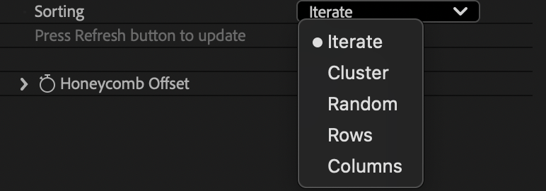

Always keep the repeater layers directly below the repeater null. Adding non-React layers between repeater layers will result in the index shifting in the repeater.

You can change the order or sorting of the layers by placing them in a different order in the composition panel.

Alternatively, use a different Sorting mode.

Change the Sorting dropdown in the repeater effect, then press Refresh.

- **Iterate**: layers cycle in sequence. With three source layers: 1, 2, 3, 1, 2, 3. This is the default.
- **Cluster**: layers group by type. With three source layers: 1, 1, 1, 2, 2, 2, 3, 3, 3.
- **Random**: random arrangement. Press Refresh again for a different arrangement.
- **Rows** (Grid only): layers arranged row by row.
- **Columns** (Grid only): layers arranged column by column.

<h3>Grid Repeater</h3>
<svg width="28" height="28"><use href="#icon-grid"/></svg>

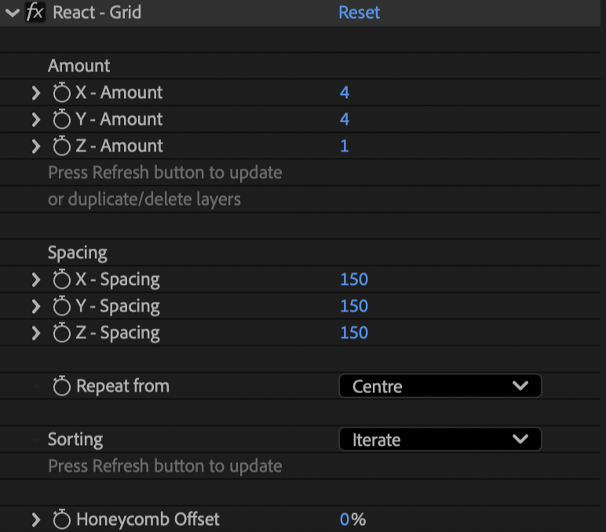

Arranges layers in a grid.

Click the Grid Repeater null to reveal the following options - 

- **X/Y/Z Amount**: number of layers per axis.
- **X/Y/Z Spacing**: distance between layers per axis.
- **Repeat from**: controls where the Repeater null sits relative to the group - either at the centre of the group or at the position of the first layer.
- **Sorting**: see 'Sorting' above.
- **Honeycomb Offset**: offsets alternating rows on X to create a honeycomb arrangement.

<h3>Radial Repeater</h3>
<svg width="28" height="28"><use href="#icon-radial"/></svg>

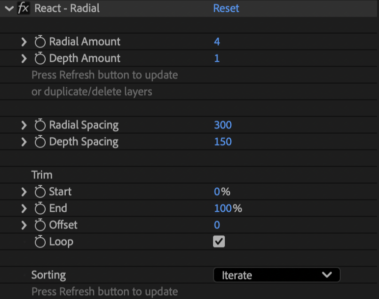

Arranges layers in a circle.

Click the Radial Repeater null to reveal the following options - 

- **Radial Amount**: number of layers in the ring.
- **Depth Amount**: number of rings in Z space.
- **Radial Spacing**: ring radius. Scale the repeater null to change this per axis.
- **Depth Spacing**: distance between rings.
- **Trim Start / End**: angle of the first and last layer in degrees.
- **Trim Offset**: shifts layer positions around the circle.
- **Loop**: when enabled, layers loop seamlessly around the circle. 
- **Sorting**: see Sorting above.

<h3>Sphere Repeater</h3>
<svg width="28" height="28"><use href="#icon-sphere"/></svg>

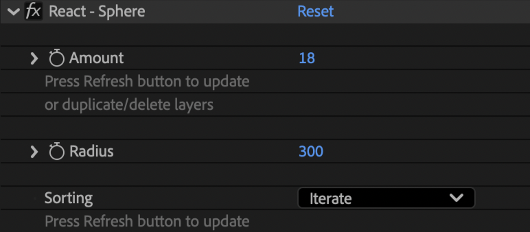

Arranges layers across the surface of a 3D sphere.

Click the Sphere Repeater null to reveal the following options - 

- **Amount**: number of layers distributed across the sphere.
- **Radius**: sphere radius. Scale the repeater null to change this per axis.
- **Sorting**: see Sorting above.

  <svg width="18" height="18" viewBox="0 0 24 24" fill="none" stroke="#2ACCFF" stroke-width="2" stroke-linecap="round" stroke-linejoin="round"><path d="M9 21h6M12 3C8.686 3 6 5.686 6 9c0 2.12 1.046 3.99 2.644 5.144C9.48 14.815 9.978 15.866 10 17h4c.022-1.134.52-2.185 1.356-2.856C16.954 12.99 18 11.12 18 9c0-3.314-2.686-6-6-6z"/></svg>
  

    Tip
    
To get layers to face outward, add an effector to any layer's rotation property. Adding a rotation effector to a sphere repeater automatically sets the mode to Look At and the target to the sphere repeater null, facing the layers outward.

  

<h3>Path Repeater</h3>
<svg width="28" height="28"><use href="#icon-path"/></svg>

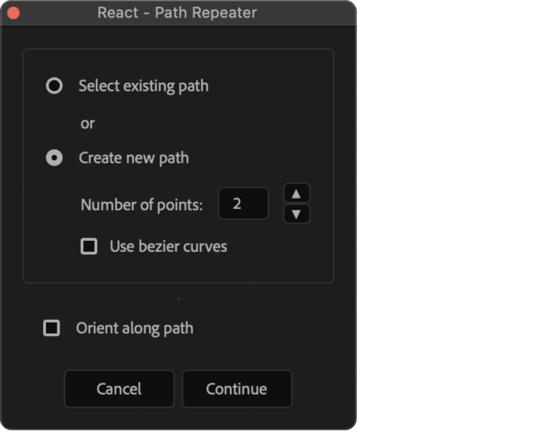

Arranges layers along a path.

Click the Path Repeater button. A dialog appears with the following options -

- **Select existing path:** click an existing path in the composition (select the path itself, not the layer), then click Continue.

- **Create Path:** set the number of points and whether to use bezier curves, then click Continue. The path runs left to right by default. Edit it in the composition as you would any shape path.

- **Orient along path:** when checked, each repeated layer rotates to follow the path direction.

Click Continue and React will create the Path Repeater null and repeat layers along the path.

  <svg width="18" height="18" viewBox="0 0 24 24" fill="none" stroke="#ff3c3c" stroke-width="2" stroke-linecap="round" stroke-linejoin="round"><path d="M12 9v4M12 17h.01M10.29 3.86L1.82 18a2 2 0 0 0 1.71 3h16.94a2 2 0 0 0 1.71-3L13.71 3.86a2 2 0 0 0-3.42 0z"/></svg>
  

    Alert
    
AE has a known issue where auto-orient can conflict with expression-driven properties that have keyframes. If layers behave unexpectedly, add a single keyframe to the Rotation property as a workaround.

  

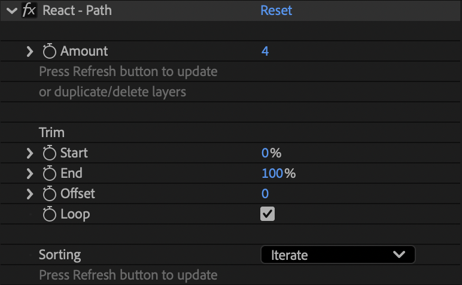

Click the Path Repeater null to reveal the following options - 

- **Amount**: number of layers distributed along the path.
- **Start / End**: position of the first and last layer as a percentage along the path. 0 = path start, 100 = path end.
- **Loop**: when enabled, layers loop along the path.
- **Offset**: shifts all layers along the path as a percentage. Useful for looping animation.
- **Sorting**: see Sorting above.

New paths have a white stroke set to width 0 by default. Increase the stroke width to see it.

### Text Layers

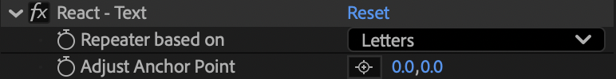

Select a single text layer before clicking any repeater button to activate Text Layer Repeater mode.

React creates a guide layer called "React - Text Source" and applies the React - Text effect to it. Each cloned layer displays a different portion of the source text. Edit the guide layer text and all repeated layers update live.

Click the text guide layer null to reveal the following options - 

**Repeater based on**: how to split the source text.

- **Letters**: each character becomes a separate layer, including spaces.
- **Letters (excluding spaces)**: each character, with spaces skipped.
- **Words**: splits at spaces.
- **Lines**: splits at paragraph breaks.

**Adjust Anchor Point**: shifts the anchor point of each text layer. Useful when the anchor is not centred on the character.

<h2>Effectors</h2>
<svg width="36" height="36"><use href="#icon-effector"/></svg>

Effectors change property values across many layers at once, making complex animations simple.

There are 7 effector types, which are automatically applied based on the property value selected. Except the Color effector, the effectors generally behave in similar ways, with the same modifiers - Noise, Wave, Elastic, Snap To and Clamp.

Single value properties, like Opacity, receive a OneD effector. Two value properties, like Start of Ramp on a Ramp effect, receive a TwoD effector. Three value properties, like 3D Point Control, receive a ThreeD effector.

The remaining 4 effectors are applied based on the property type, either Position, Rotation, Scale or Color. Each of these effectors has its own special controls.

### Adding an effector

Select any layer property: Position, Scale, Rotation, Opacity, Trim Paths, a color property, or any other property that accepts keyframes.

Press **Add Effector**.

If the property belongs to a layer inside a repeater, the effector is applied to the same property on every layer in that repeater. To add a position effector to a grid repeater, select one position property from any layer in the repeater. React handles the rest.

  <svg width="18" height="18" viewBox="0 0 24 24" fill="none" stroke="#2ACCFF" stroke-width="2" stroke-linecap="round" stroke-linejoin="round"><path d="M9 21h6M12 3C8.686 3 6 5.686 6 9c0 2.12 1.046 3.99 2.644 5.144C9.48 14.815 9.978 15.866 10 17h4c.022-1.134.52-2.185 1.356-2.856C16.954 12.99 18 11.12 18 9c0-3.314-2.686-6-6-6z"/></svg>
  

    Tip
    
Hold Alt to apply the effector to the selected layer only, regardless of the repeater.

  

Select multiple properties before clicking to control them all from one effector null.

React creates two layers: an Effector null and a guide layer. The guide visualises the falloff area. It is only visible when Falloff Shape is set to something other than Off.

3DBy default the Effector null is a 2D layer. Enable 3D on the null to use the Z position and 3D rotations. A circle falloff becomes a sphere falloff, a box becomes a 3D box and a linear becomes a 3D linear falloff

You can apply multiple effectors to the same property — just repeat the process.

### Effector Controls

Select the Effector null to see its controls in the Effects panel.

There are two effects: **React - Effector** (global controls) and one effect per property, for example React - Effector | Position.

#### React - Effector

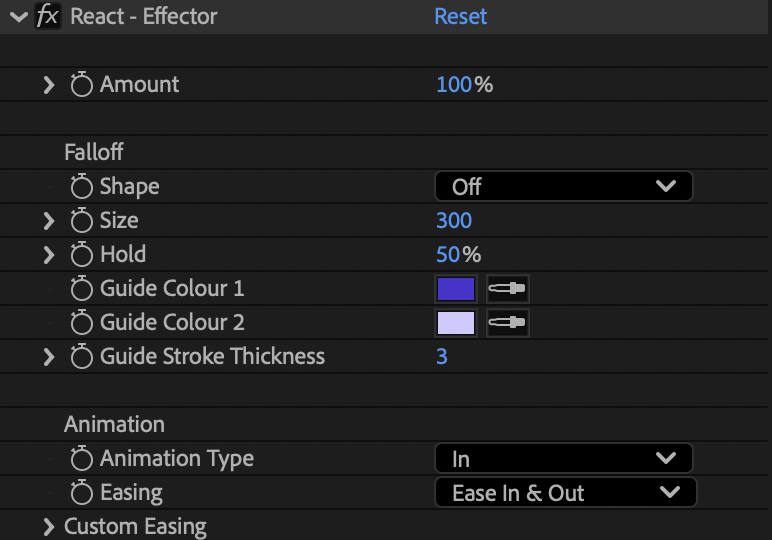

**Amount**

Overall strength of the effector. 100% by default. Keyframe this to fade the effector in or out.

**Falloff**

Controls how the effector's influence is distributed spatially.

- **Shape**:
  - **Off**: all layers affected equally regardless of position.
  - **Circle**: circular influence zone. Scale the null to change the shape. Enable 3D on the null for sphere falloff.
  - **Box**: rectangular influence zone. Scale the null to set size. Rotate the null to change orientation. Enable 3D on the null for box falloff.
  - **Linear**: influence falls off along a line. Direction is set by null rotation. Enable 3D on the null for 3D linear falloff.
- **Size**: radius or extent of the falloff zone. Also controlled by the null's scale.
- **Hold**: sharpness of the falloff edge. 0% is a gradual transition. 100% is a hard edge.

**Animation**

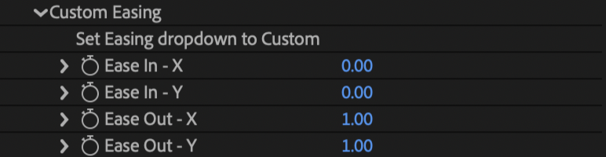

Controls how the effector value distributes across layers.

- **Animation Type**:
  - **In**: layers outside the falloff = 0% affected, layers inside the hold of the falloff = 100% affected.
  - **In & Out**: layers outside and inside the hold of the falloff = 0% affected, layers half-way across = 100% affected.
  - **Inverse**: reverses the In direction.
- **Easing**: Linear, Ease In, Ease Out, Ease In & Out, Custom.
- **Custom Easing** (active when Custom is selected):
  - **Ease In - X / Y**: moves the lower-left point of the easing curve.
  - **Ease Out - X / Y**: moves the upper-right point of the easing curve.

#### The Position Effector

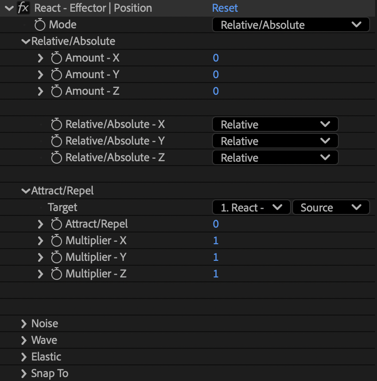

There are two modes on the Position effector - Relative/Absolute and Attract/Repel.

**Relative/Absolute**

Offset or set the position directly.

Each axis (X, Y, Z) has its own Relative/Absolute toggle.

Relative adds to the layer's current position. Absolute sets a fixed position.

**Attract/Repel**

Moves layers toward or away from a target.

By default, the Effector null is the target. Change that target with the **Target** dropdown.

Use **Attract/Repel** to push or pull layers - positive values push layers away. Negative values pull them in.

Change the **X/Y/Z Multipliers** to scale the effect independently per axis.

#### The Rotation Effector

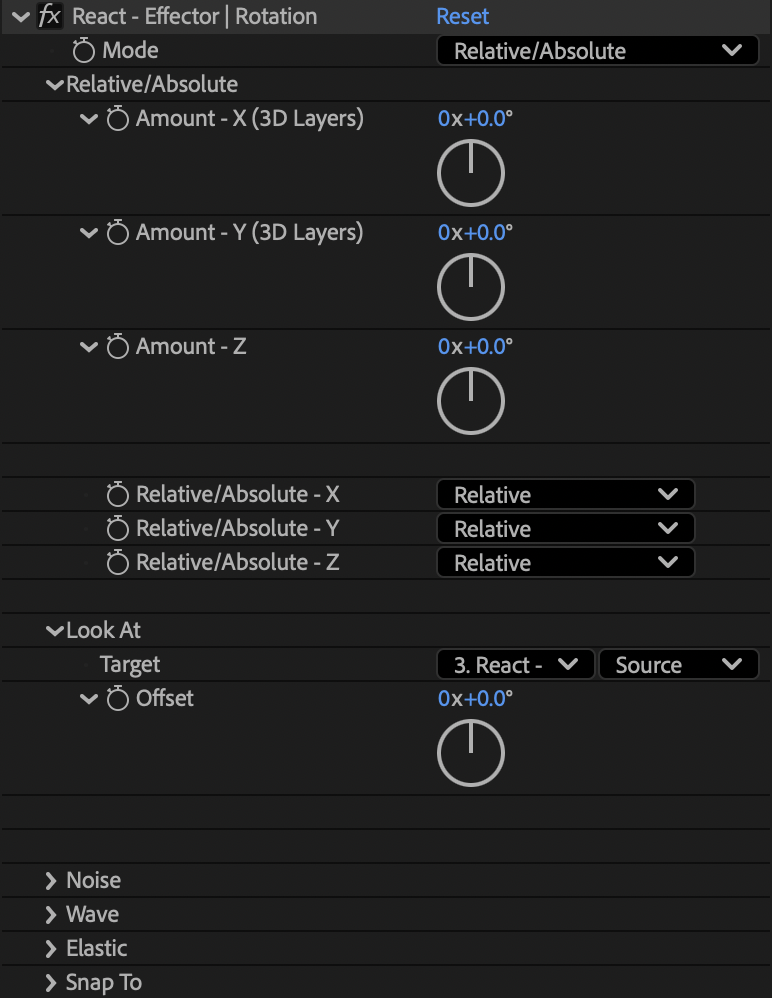

All three rotation axes share the same effector. Only one axis needs to be selected before applying a Rotation effector.

If a layer is 2D, only the Z rotation properties will have an effect.

There are two modes on the Rotation effector - Relative/Absolute and Look At.

**Relative / Absolute**

Offset or set the rotation directly. X and Y only affect 3D layers.

Each axis (X, Y, Z) has its own Relative/Absolute toggle.

Relative adds to the layer's current rotation. Absolute sets a fixed rotation.

**Look At**

Rotates layers to face a target.

By default, the Effector null is the target. Change that target with the **Target** dropdown.

Use **Offset** to add or subtract a rotational offset to the calculation.

  <svg width="18" height="18" viewBox="0 0 24 24" fill="none" stroke="#2ACCFF" stroke-width="2" stroke-linecap="round" stroke-linejoin="round"><path d="M9 21h6M12 3C8.686 3 6 5.686 6 9c0 2.12 1.046 3.99 2.644 5.144C9.48 14.815 9.978 15.866 10 17h4c.022-1.134.52-2.185 1.356-2.856C16.954 12.99 18 11.12 18 9c0-3.314-2.686-6-6-6z"/></svg>
  

    Tip
    
Look At also works in 3D - enable 3D for all layers and the effector null.

  

#### The Scale Effector

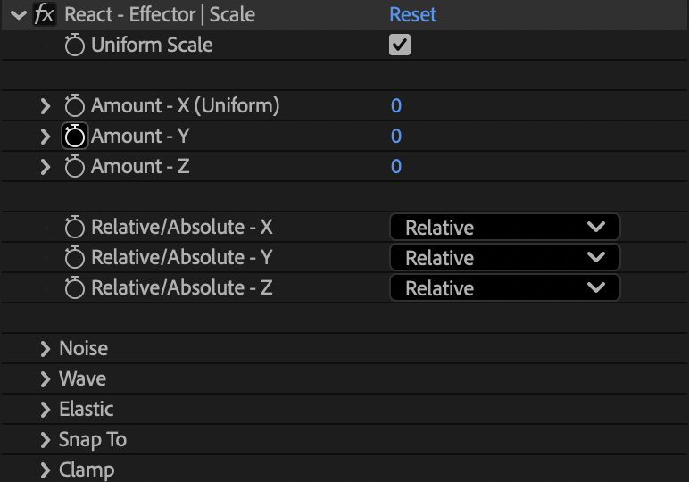

This effector is similar to other effectors, with one small difference - Uniform Scale.

**Uniform Scale**

When enabled, the X value applies to all axes.

**Relative / Absolute**

Offset or set the scale directly. Y and Z only work with **Uniform Scale** disabled.

Each axis (X, Y, Z) has its own Relative/Absolute toggle.

Relative adds to the layer's current scale. Absolute sets a fixed scale.

#### The Color Effector

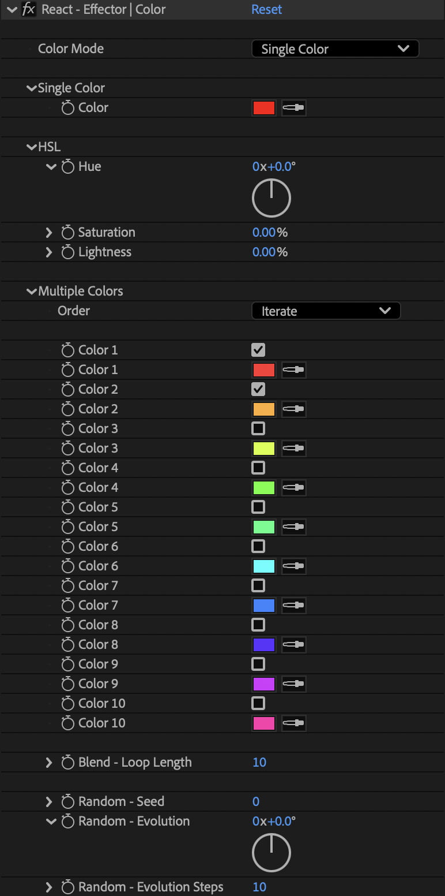

This effector is different from the other effectors. It does not have any modifiers and it has different modes.

**Single Color**

Sets all affected layers to one color, set with the **Color** setting.

**HSL**

Shifts hue, saturation, and lightness, set by their respective settings.

**Multiple Colors**

Assigns colors from a palette of up to 10 colors. Enable each color with its checkbox.
  
  - **Order**: how colors are distributed.
    - **Iterate**: colors assigned in sequence, repeating.
    - **Blend**: colors blended smoothly across layers. **Blend - Loop Length** sets how many layers span one full blend cycle.
    - **Random**: colors distributed randomly. Use **Seed**, **Evolution**, and **Evolution Step** to control the pattern.

#### Other Effectors

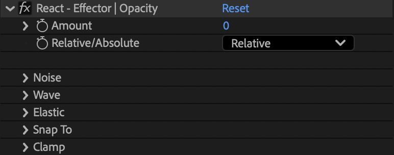

For properties that are not Position, Rotation, Scale, or Color, React applies a generic effector based on the number of dimensions.

- **1D**: single-value properties such as Opacity, Trim Paths, or any slider control.
- **2D**: two-dimensional properties such as a 2D point.
- **3D**: three-dimensional properties such as a 3D position or Anchor Point.

Each generic effector has the same Relative/Absolute mode and all five modifiers. Controls are labelled per axis (X, Y, Z) as applicable.

## Modifiers

Every effector except Color has five modifiers: Noise, Wave, Elastic, Snap To, and Clamp.

### Noise

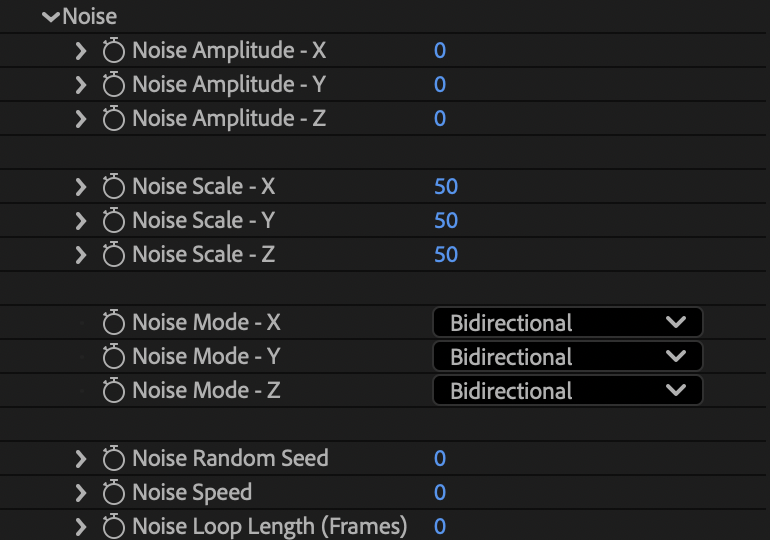

Adds noise and randomness to a property.

Noise replaces React 2's Random modifier with more control over your layers.

**Noise Amplitude**

The amount of noise per axis. Set to 0 to disable.

**Noise Scale**

The amount of correlation the noise has across layers, based on their position in the comp.

Lower values will appear more random, with 0 being completely random.

Higher values will have similar noise values across layers. Good if you want to create a wind effect.

**Noise Mode**

Bidirectional (positive and negative variation) or Unidirectional (one direction only).

For example, with a Noise Amplitude of -100, bidirectional would produce randomness between -100 and 100. Unidirectional would produce randomness between 0 and -100.

**Noise Seed**

Changes the noise pattern.

**Noise Speed**

How fast the noise evolves over time. Set to 0 to disable animation.

**Noise Loop Length**

Number of frames for a seamless loop. Set to 0 to disable looping.

### Wave

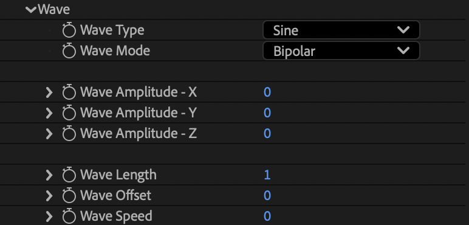

Adds a repeating wave pattern across layers.

Each layer is offset along the wave based on its position in the repeater.

Wave replaces React 2's Step modifier with additional options.

**Wave Type**

Shape of the wave. Choose from Sine, Triangle, Ramp Up, Ramp Down and Square.

**Wave Mode**

Choose from Bipolar (wave swings positive and negative) or Unipolar (one direction only).

**Wave Amplitude**

Height of the wave, per axis. Set to 0 to disable.

**Wave Length**

How many layers span one full wave cycle. Automatically set to the number of layers in a repeater.

**Wave Offset**

Shifts the starting position of the wave across layers.

**Wave Speed**

How fast the wave pattern moves over time. Set to 0 to disable animation.

### Elastic

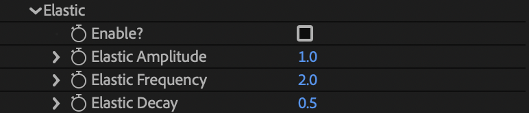

Adds a spring bounce when the effector value changes.

**Elastic**

Turns elastic on or off. Off by default.

**Amplitude**

Multiplier for bounce strength. Higher values produce a larger overshoot.

**Frequency**

Oscillation speed in cycles per second. Higher values produce more bounces.

**Decay**

How quickly the bounce settles, in frames. Lower values settle faster.

  <svg width="18" height="18" viewBox="0 0 24 24" fill="none" stroke="#ff3c3c" stroke-width="2" stroke-linecap="round" stroke-linejoin="round"><path d="M12 9v4M12 17h.01M10.29 3.86L1.82 18a2 2 0 0 0 1.71 3h16.94a2 2 0 0 0 1.71-3L13.71 3.86a2 2 0 0 0-3.42 0z"/></svg>
  

    Alert
    
Elastic does not work with Attract/Repel mode on the Position effector or Look At mode on the Rotation effector.

  

### Snap To

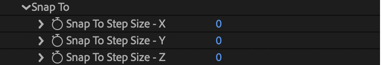

Snaps the output value to the nearest multiple of an increment.

This is the same function as React 2's Sticky modifier, just with a clearer name.

**Snap To**

The snap increment (per axis). Set to 0 to disable.

### Clamp

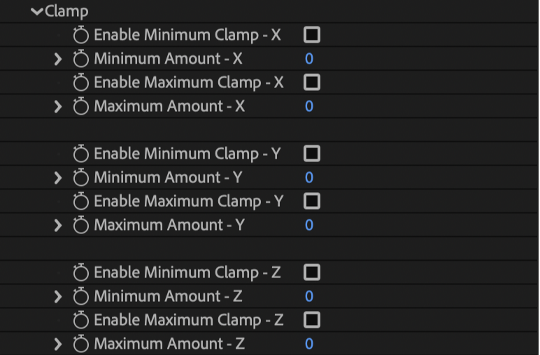

Limits the output to a minimum or maximum value. Applied last, after all other modifiers.

**Clamp Min**

For X/Y/Z, enable with the checkbox, then set the minimum value.

**Clamp Max**

For X/Y/Z, enable with the checkbox, then set the maximum value.

<h2>Tracer</h2>
<svg width="36" height="36"><use href="#icon-tracer"/></svg>

The Tracer creates a shape layer that draws lines between repeated layers. The path expression updates live as layer positions change. Set stroke color, width, and dash settings directly in the shape layer properties.

  <svg width="18" height="18" viewBox="0 0 24 24" fill="none" stroke="#ff3c3c" stroke-width="2" stroke-linecap="round" stroke-linejoin="round"><path d="M12 9v4M12 17h.01M10.29 3.86L1.82 18a2 2 0 0 0 1.71 3h16.94a2 2 0 0 0 1.71-3L13.71 3.86a2 2 0 0 0-3.42 0z"/></svg>
  

    Alert
    
After a Repeater Refresh, a new tracer must be added. Delete the old tracer and apply a new one to the updated Repeater.

  

### Adding a tracer

**Repeater tracer**

Select one React Repeater null, then click Add Tracer. The tracer connects all layers in that repeater.

**Layer tracer**

Select two or more layers in the order you want them connected (excluding Repeater nulls), then click Add Tracer.

React creates a shape layer called "React - Tracer 1". Additional tracers increment the number.

### Tracer Settings

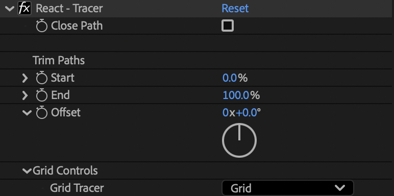

In the React - Tracer effect on the tracer shape layer:

**Close Path**

Closes the path by joining the last layer back to the first.

**Trim Paths**

A quick way of accessing the controls for the automatically applied Trim Paths effect.

Use **Start**, **End** and **Offset** controls to change the trim of the path.

**Grid Controls**

Used for Grid repeaters only.

- **Grid**: connects layers in standard grid order.
- **Snake**: row-by-row path, alternating direction each row.
- **Zig Zag**: alternating direction without reversing.

<h2>Refresh</h2>
<svg width="36" height="36"><use href="#icon-refresh"/></svg>

This button has two jobs - Repeater Refresh and Effector Refresh. 

### Repeater Refresh

Update the **Amount** and the **Sorting** on a Repeater null and press the Refresh button to update the layers.

- If Amount has changed, React adds or removes layers to match.
- If Sorting has changed, React reorders the layers.
- Tree characters (`├` and `└`) update if the layer order has been rearranged.

### Effector Refresh

Select an Effector null, and one or more properties from another layer, then click Refresh.

- React adds the selected properties to the existing effector.
- If the property belongs to a layer inside a repeater, the effector is applied to every layer in that repeater.

<h2>Delete</h2>
<svg width="36" height="36"><use href="#icon-delete"/></svg>

Select one or more Repeater or Effector nulls, then click Delete.

If only a Repeater is deleted and it has no keyframes, React deletes it with no further options.

If an Effector is selected and/or a Repeater with keyframes, a dialog appears with three options:

- **No Baking**: removes all React expressions and layers. Properties return to their pre-React values.
- **Bake Current Frame**: captures the current value of each affected property as a static value, then removes React elements.
- **Bake All Frames**: evaluates every frame and creates keyframes for the full animation, then removes React elements. This can take time on complex compositions.

When deleting an Effector from a property that also has a Repeater, React removes only the Effector block. The Repeater expression is preserved.

When deleting one effector from a property controlled by multiple effectors, React measures that effector's contribution in isolation before baking. The remaining effectors are not affected.
